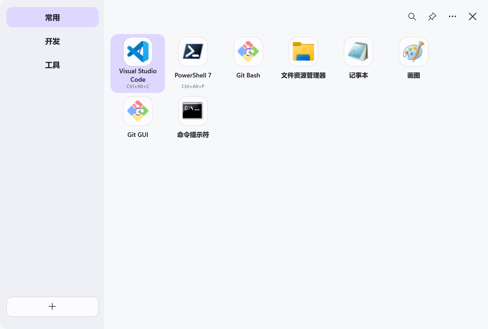
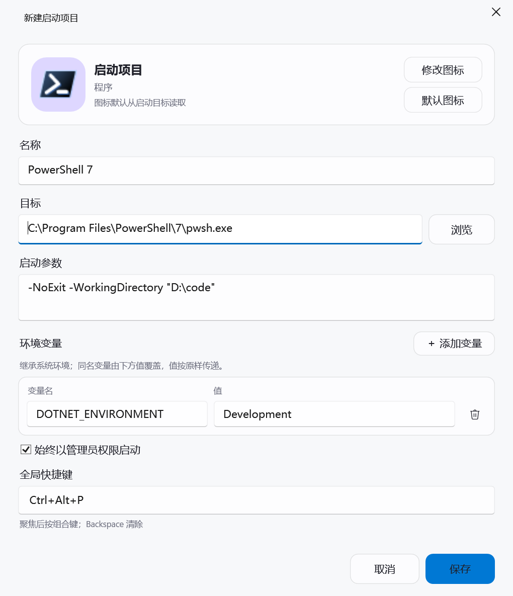

# Kyvoq

Kyvoq 是一个面向 Windows 11 x64 的高性能快速启动器。界面采用左侧分组、右侧虚拟化图标网格，支持程序、文件、快捷方式和网址，并可通过全局快捷键直接启动项目。

## 界面预览

### 主界面

示例项目展示了分组、名称自动换行、程序图标和项目级快捷键；这些项目仅用于界面预览，不会写入默认配置。

<p align="center">
  
</p>

### 添加项目

添加项目时可设置启动目标、参数、环境变量、自定义图标、管理员权限和全局快捷键。

<p align="center">
  
</p>

## 主要功能

- 新建、重命名、排序和删除分组；项目或分组删除后可在 5 秒内撤销。
- 从资源管理器拖入文件，也可在网格中排序，或把图标拖到左侧分组。
- 配置程序参数、环境变量、自定义图标、管理员权限和项目级全局快捷键；管理员启动同样支持环境变量。
- 使用默认快捷键 `Alt+Space` 呼出或隐藏主界面，也可在设置中重新绑定。
- 当前台程序独占全屏或无边框全屏时忽略全部全局快捷键；Edge、Chrome、Firefox、Brave、Opera 和 Vivaldi 不受此限制。
- 面板未固定时，按 `Esc`、点击其他位置或切换程序会自动隐藏；固定后会保持在其他窗口前方，仅 `Esc`、关闭按钮或呼出快捷键会隐藏主面板。
- 关闭主窗口后驻留通知区域，项目快捷键仍然有效。
- 基于 WPF UI 的 Fluent 主题，支持跟随系统、浅色、深色、系统或自定义强调色，以及纯色、云母、云母 Alt 和接近 Windows 11 开始菜单的原生亚克力材质。
- 配置原子保存、最近有效备份、损坏恢复以及完整 JSON 导入导出。
- 单实例运行、可选登录启动、异步 Shell 图标提取和两级图标缓存。

## 使用方式

1. 从“更多”菜单选择“添加项目…”，选择程序或输入网址；也可以直接把目标拖入当前分组。
2. 鼠标悬停侧栏分组即可切换；拖动图标可调整顺序，拖到左侧分组可移动项目。
3. 单击图标启动；右键可管理员启动、打开所在位置、复制路径、编辑或删除。
4. 单击标题栏搜索按钮或按 `Ctrl+F` 可搜索全部分组。
5. 右上角图钉可固定主面板并保持置顶；搜索面板始终在失去焦点时自动隐藏。
6. 关闭按钮会隐藏到通知区域；需要彻底结束时使用托盘或“更多”菜单中的“退出 Kyvoq”。

配置和图标缓存默认位于 `%LocalAppData%\Kyvoq`。导入配置会覆盖当前数据，覆盖前的配置由原子保存流程保留为 `config.json.bak`。

## 开发与验证

环境要求：Windows 11 x64 与 .NET 10 SDK。

```powershell
dotnet restore Kyvoq.slnx
dotnet build Kyvoq.slnx --configuration Release
dotnet test Kyvoq.slnx --configuration Release
dotnet run --project src\Kyvoq.App\Kyvoq.App.csproj
```

项目开启可空引用类型和警告即错误。所有 C# 方法及测试方法均使用中文 XML 文档注释。

## 发布

下面的命令会生成依赖框架、ReadyToRun、非单文件的 `win-x64` 版本，输出到 `artifacts\publish\win-x64`。目标电脑需要预先安装 .NET 10 Desktop Runtime x64：

```powershell
dotnet publish src\Kyvoq.App\Kyvoq.App.csproj /p:PublishProfile=win-x64
```

依赖框架发布不会附带 .NET 和 Windows 系统运行库，可显著缩小发布目录；应用自身及 WPF-UI 等必要第三方依赖仍会保留。选择多文件发布是为了避免单文件提取或压缩带来的启动成本，WPF 不启用裁剪以避免反射、XAML 和桌面组件被错误移除。

## 解决方案结构

- `src/Kyvoq.Core`：配置模型、校验、搜索、排序、启动规则和 JSON 持久化。
- `src/Kyvoq.App`：WPF 界面、Windows 11 窗口材质、托盘、图标缓存、单实例和 Win32 全局快捷键。
- `tests/Kyvoq.Tests`：核心规则和持久化回归测试。
- `tests/Kyvoq.App.Tests`：图标缓存、单实例管道和真实窗口句柄快捷键集成测试。
- `tests/Kyvoq.LaunchFixture`：验证参数、程序目录与环境变量传递的最小子进程夹具。

首版不支持 Windows 10、ARM64、插件、云同步、UWP 应用枚举或直接执行用户输入的 PowerShell/CMD 命令字符串。
